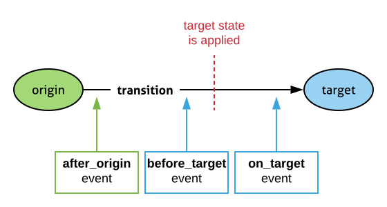
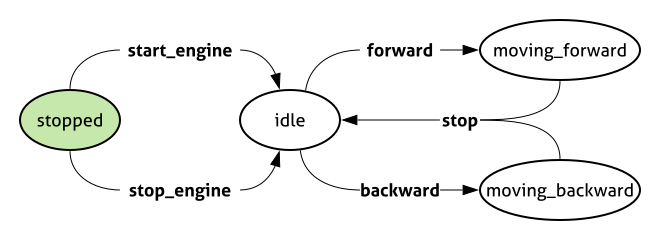

# FAVink

[](https://codeclimate.com/github/k-vinogradov/favink/maintainability)
[](https://www.codefactor.io/repository/github/k-vinogradov/favink)
[](https://travis-ci.org/k-vinogradov/favink)

Over-simple python finite automata (finite-state machine) implementation

## Getting Started

To install favink use the package from the PyPI repository:

    pip install favink

To add finite automata feature to the class in your code you have to inherit
FiniteAutomata class and define the following members:

- transitions table `transitions`
- initial state `init_state`
- event handlers methods.

The constructor creates a dynamic method for every transition defined
in the table. Each method is named after the transition.

To make the transition you should call the transition method. After the method
has been called it changes the instance state and invoke related event handlers.
If the called transition isn't allowed for the current state `InvalidTransition`
extension will be raised.

## Transition Table and Initial State

The `transitions` is a dictionary where keys are transition names,
values define the allowed and target states:

```Python
transitions = {
    "transition_1":
    [
        "allowed_state_1",
        "target_state_1"
    ],
    "transition_2":
    [
        [
            "allowed_state_2",
            "allowed_state_3"
        ],
        "target_state_2"
    ]
}
```

Initial state is defined by `init_state` member.

## Events



Making of transition triggers the following methods and invokes the related handlers
(if they have been implemented in the class):

- `after`
- `before`
- `on`

### Event Handler Definitions

For every state (for example `state_name`) you following methods you can define:

```Python
def before_state_name(self, transition):
    ...


def on_state_name(self, transition, origin_state):
    ...


def after_state_name(self, transition):
    ...
```

## Car Example


